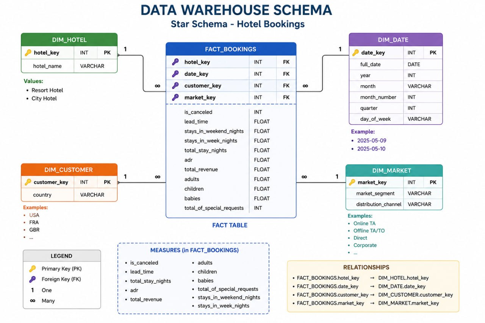

<p align="center">
  
  
  
  
  
  
</p>

<h1 align="center">🏨 Big Data Hotel Booking Pipeline</h1>

<p align="center">
  <strong>End-to-end Big Data pipeline for processing hotel booking data</strong><br/>
  <em>Airflow • HDFS • PySpark • Snowflake • Docker</em>
</p>

<p align="center">
  <a href="#-architecture">Architecture</a> •
  <a href="#-tech-stack">Tech Stack</a> •
  <a href="#-pipeline-workflow">Pipeline Workflow</a> •
  <a href="#-project-structure">Project Structure</a> •
  <a href="#-getting-started-on-ubuntu">Setup Guide</a> •
  <a href="#-web-interfaces">Web Interfaces</a> •
  <a href="#-key-files-explained">Key Files</a> •
  <a href="#-data-warehouse-schema">DWH Schema</a>
</p>

---

## 📋 Overview

This project implements a **complete Big Data ETL pipeline** that processes hotel booking data through multiple stages — from raw CSV ingestion all the way to a clean, queryable data warehouse on **Snowflake**. The entire infrastructure is containerized using **Docker Compose**, making it fully reproducible and easy to deploy.

### What does this pipeline do?

1. **Ingests** raw hotel booking CSV data (~120K records)
2. **Stores** it in a distributed file system (HDFS)
3. **Transforms** it using Apache Spark (PySpark) — cleaning, deduplication, type casting, and feature engineering
4. **Loads** the processed Parquet data into Snowflake Data Warehouse
5. **Validates** the loaded data with SQL aggregation queries
6. **Orchestrates** the entire workflow automatically using Apache Airflow

---

## 🏗 Architecture

```
┌─────────────────────────────────────────────────────────────────────────────┐
│                        PIPELINE ARCHITECTURE                                │
├─────────────────────────────────────────────────────────────────────────────┤
│                                                                             │
│   ┌──────────┐     ┌──────────┐     ┌──────────┐     ┌──────────────────┐   │
│   │          │     │          │     │          │     │                  │   │
│   │  Raw CSV │───▶│   HDFS   │────▶│  PySpark │────▶│    Snowflake     │  │
│   │  (Local) │     │ (Hadoop) │     │   ETL    │     │  Data Warehouse  │   │
│   │          │     │          │     │          │     │                  │   │
│   └──────────┘     └──────────┘     └──────────┘     └──────────────────┘   │
│        │                                                      │             │
│        │              ┌──────────────────┐                    │             │
│        └──────────────│  Apache Airflow  │────────────────────┘             │
│                       │  (Orchestrator)  │                                  │
│                       └──────────────────┘                                  │
│                                                                             │
│   Infrastructure: Docker Compose (12 containers on a custom bridge network) │
└─────────────────────────────────────────────────────────────────────────────┘
```

> 📄 A detailed architecture diagram is available at [`docs/Architecture_Diagram.pdf`](docs/Architecture_Diagram.pdf)

### Pipeline Flow (Step by Step)

| Step | Task | Tool | Description |
|------|------|------|-------------|
| 1 | `prepare_hdfs` | Airflow → HDFS | Creates the `/data` directory in HDFS |
| 2 | `upload_csv_to_hdfs` | Airflow → HDFS | Copies the raw CSV from local storage into HDFS |
| 3 | `run_spark_etl` | Airflow → Spark | Runs the PySpark ETL job for cleaning & transformation |
| 4 | `verify_hdfs_output` | Airflow → HDFS | Verifies the Parquet output exists in HDFS |
| 5 | `load_to_snowflake` | Airflow → Snowflake | Reads Parquet from HDFS and loads into Snowflake |
| 6 | `validate_snowflake` | Airflow → Snowflake | Runs validation queries on the final table |

---

## 🛠 Tech Stack

| Technology | Role | Version |
|------------|------|---------|
| **Apache Airflow** | Workflow orchestration & scheduling | 2.10.4 |
| **Apache Spark (PySpark)** | Distributed data processing & ETL | 3.x (via Jupyter image) |
| **Hadoop HDFS** | Distributed file storage | 3.2.1 |
| **Hadoop YARN** | Resource management for the cluster | 3.2.1 |
| **Snowflake** | Cloud data warehouse (final destination) | Cloud |
| **PostgreSQL** | Airflow metadata database | 13 |
| **Jupyter Notebook** | Interactive data exploration | Latest |
| **Docker & Docker Compose** | Containerization & orchestration | v3.9 compose spec |
| **Python** | Core programming language | 3.x |
| **Pandas & PyArrow** | Data manipulation & Parquet support | Latest |

---

## 📂 Project Structure

```
Big-Data/
│
├── 📁 dags/
│   └── 📄 hotel_final_pipeline.py      # Main Airflow DAG — orchestrates the entire pipeline
│
├── 📁 scripts/
│   ├── 📄 etl_hotel.py                 # PySpark ETL script — cleans & transforms data
│   └── 📄 load_to_dwh.py               # Alternative loader — PySpark to PostgreSQL (JDBC)
│
├── 📁 data/
│   └── 📄 hotel_bookings_processed.csv  # Raw source dataset (~120K rows, ~11MB)
│
├── 📁 jars/
│   └── 📄 postgresql-42.5.1.jar         # PostgreSQL JDBC driver for Spark
│
├── 📁 notebooks/                        # Jupyter notebooks for exploration (mounted to Spark container)
├── 📁 config/                           # Airflow configuration overrides
├── 📁 plugins/                          # Custom Airflow plugins
├── 📁 logs/                             # Airflow task execution logs
├── 📁 output/                           # Pipeline output files
│
├── 📁 docs/
│   ├── 📄 Architecture_Diagram.pdf      # Visual architecture diagram
│   └── 📄 DWH_Schema.jpg               # Data Warehouse star schema diagram
│
├── 🐳 docker-compose.yaml              # Full infrastructure definition (12 services)
├── 🐳 Dockerfile.airflow               # Custom Airflow image with Python dependencies
├── 📄 requirements.txt                  # Python dependency list
├── 📄 LICENSE                           # Project license
└── 📄 README.md                         # This file
```

---

## 🚀 Getting Started on Ubuntu

### Prerequisites

| Requirement | Minimum Version | Install Command |
|-------------|-----------------|-----------------|
| **Ubuntu** | 20.04+ | — |
| **Docker** | 20.10+ | See below |
| **Docker Compose** | v2.0+ | Included with Docker |
| **Git** | 2.x | `sudo apt install git` |
| **RAM** | 8 GB minimum (16 GB recommended) | — |
| **Disk** | 20 GB free space | — |

### Step 1 — Install Docker & Docker Compose

```bash
# Update system packages
sudo apt update && sudo apt upgrade -y

# Install required packages
sudo apt install -y ca-certificates curl gnupg lsb-release

# Add Docker's official GPG key
sudo mkdir -p /etc/apt/keyrings
curl -fsSL https://download.docker.com/linux/ubuntu/gpg | sudo gpg --dearmor -o /etc/apt/keyrings/docker.gpg

# Add Docker repository
echo "deb [arch=$(dpkg --print-architecture) signed-by=/etc/apt/keyrings/docker.gpg] \
  https://download.docker.com/linux/ubuntu $(lsb_release -cs) stable" | \
  sudo tee /etc/apt/sources.list.d/docker.list > /dev/null

# Install Docker Engine + Compose plugin
sudo apt update
sudo apt install -y docker-ce docker-ce-cli containerd.io docker-compose-plugin

# Allow your user to run Docker without sudo
sudo usermod -aG docker $USER
newgrp docker

# Verify installation
docker --version
docker compose version
```

### Step 2 — Clone the Repository

```bash
git clone https://github.com/The-lucky-Survivor/Big-Data.git
cd Big-Data
```

### Step 3 — Prepare Directory Permissions

```bash
# Create required directories
mkdir -p ./logs ./plugins ./config ./output ./notebooks

# Set Airflow UID (important for file permissions)
echo -e "AIRFLOW_UID=$(id -u)" > .env
```

### Step 4 — Build & Start the Infrastructure

```bash
# Build the custom Airflow image and start all services
docker compose up -d --build

# This will start 12 containers:
#   - postgres_airflow, airflow-webserver, airflow-scheduler
#   - airflow-triggerer, airflow-init
#   - spark-jupyter
#   - hadoop-namenode, hadoop-datanode1, hadoop-datanode2
#   - resourcemanager, hadoop-nodemanager, hadoop-nodemanager2
```

> ⏳ **First run takes 5-10 minutes** to pull all Docker images and initialize services.

### Step 5 — Verify All Services Are Running

```bash
docker compose ps
```

You should see all containers in `Up` or `healthy` state.

### Step 6 — Configure Snowflake Connection in Airflow

1. Open Airflow UI: **http://localhost:18080**
2. Login with: **Username:** `airflow` / **Password:** `airflow`
3. Go to **Admin → Connections**
4. Click **+ (Add a new record)**
5. Fill in:

| Field | Value |
|-------|-------|
| Connection Id | `snowflake_default` |
| Connection Type | `Snowflake` |
| Account | `your-account.region` |
| Login | `your_username` |
| Password | `your_password` |
| Schema | `PUBLIC` |
| Warehouse | `your_warehouse` |
| Database | `your_database` |
| Role | `your_role` |

6. Click **Save**

### Step 7 — Trigger the Pipeline

1. In the Airflow UI, find the DAG: **`hotel_final_pipeline`**
2. Toggle the DAG **ON** (unpause it)
3. Click the **▶ Play button** → **Trigger DAG**
4. Monitor progress in the **Graph View**

### Step 8 — Verify Results

```bash
# Check HDFS for processed data
docker exec hadoop-namenode hdfs dfs -ls /data/hotel_processed

# Check Snowflake (via Airflow logs or Snowflake UI)
# The validate_snowflake task will print row counts and aggregations
```

---

## 🌐 Web Interfaces

| Service | URL | Credentials |
|---------|-----|-------------|
| **Airflow UI** | [http://localhost:18080](http://localhost:18080) | `airflow` / `airflow` |
| **Jupyter Notebook** | [http://localhost:8899](http://localhost:8899) | No password (token disabled) |
| **HDFS NameNode UI** | [http://localhost:9870](http://localhost:9870) | No auth required |
| **YARN ResourceManager** | [http://localhost:8088](http://localhost:8088) | No auth required |
| **Spark UI** | [http://localhost:4040](http://localhost:4040) | No auth required (only during job execution) |
| **DataNode 1 UI** | [http://localhost:9864](http://localhost:9864) | No auth required |
| **DataNode 2 UI** | [http://localhost:9865](http://localhost:9865) | No auth required |

---

## 📖 Key Files Explained

### 1. `dags/hotel_final_pipeline.py` — The Orchestrator

This is the **brain** of the project. It's an Apache Airflow DAG that defines the **entire pipeline as a sequence of 6 tasks**:

```
prepare_hdfs → upload_csv → run_spark_etl → verify_output → load_to_snowflake → validate_snowflake
```

**Key concepts inside:**
- **`BashOperator`** — Executes shell commands (used for HDFS operations and Spark submit)
- **`PythonOperator`** — Runs Python functions (used for loading data to Snowflake)
- **`SnowflakeOperator`** — Runs SQL queries directly on Snowflake
- **`docker exec`** — The DAG controls other containers by executing commands inside them via Docker socket
- **`write_pandas()`** — Snowflake's optimized bulk loader for Pandas DataFrames

### 2. `scripts/etl_hotel.py` — The ETL Engine

This is the **PySpark script** that performs the actual data transformation:

| Operation | What it does |
|-----------|--------------|
| **Read CSV** | Reads raw data from HDFS with schema inference |
| **Drop Duplicates** | Removes duplicate records |
| **Cast Types** | Converts numeric columns to `DoubleType` |
| **Parse Dates** | Converts `reservation_status_date` to proper date format |
| **Feature Engineering** | Creates `total_stay_nights` = weekend + weekday nights |
| **Revenue Calculation** | Creates `total_revenue` = ADR × total nights |
| **Column Selection** | Keeps only the 18 required columns |
| **Write Parquet** | Saves cleaned data as Parquet back to HDFS |

### 3. `scripts/load_to_dwh.py` — Alternative DWH Loader

An alternative loading script that writes data from HDFS Parquet directly to **PostgreSQL** using Spark's JDBC connector. This is useful for scenarios where Snowflake is not available.

### 4. `docker-compose.yaml` — The Infrastructure

Defines **12 Docker services** across 3 layers:

| Layer | Services | Purpose |
|-------|----------|---------|
| **Airflow** | postgres, webserver, scheduler, triggerer, init | Pipeline orchestration |
| **Spark/Jupyter** | jupyter (pyspark-notebook) | Data processing engine |
| **Hadoop** | namenode, 2 datanodes, resourcemanager, 2 nodemanagers | Distributed storage & resource management |

**Notable configurations:**
- Custom bridge network (`sparknet`) with subnet `172.30.0.0/16` — all services get static IPs
- Docker socket mounted (`/var/run/docker.sock`) — allows Airflow to manage other containers
- Shared volumes for data, DAGs, notebooks, and JAR files

### 5. `Dockerfile.airflow` — Custom Airflow Image

```dockerfile
FROM apache/airflow:2.10.4
RUN pip install --no-cache-dir pyspark pandas pyarrow snowflake-connector-python
```

Extends the official Airflow image with the Python packages needed for PySpark integration and Snowflake connectivity.

---

## 🗄 Data Warehouse Schema

The project uses a **Star Schema** design for the data warehouse:

<p align="center">
  
</p>

### Fact Table: `FACT_BOOKINGS`

| Column | Type | Description |
|--------|------|-------------|
| `hotel_key` | INT (FK) | Links to DIM_HOTEL |
| `date_key` | INT (FK) | Links to DIM_DATE |
| `customer_key` | INT (FK) | Links to DIM_CUSTOMER |
| `market_key` | INT (FK) | Links to DIM_MARKET |
| `is_canceled` | INT | Whether booking was canceled (0/1) |
| `lead_time` | FLOAT | Days between booking and arrival |
| `stays_in_weekend_nights` | FLOAT | Weekend nights stayed |
| `stays_in_week_nights` | FLOAT | Weekday nights stayed |
| `total_stay_nights` | FLOAT | Total nights (calculated) |
| `adr` | FLOAT | Average Daily Rate |
| `total_revenue` | FLOAT | Total revenue (calculated) |
| `adults` | FLOAT | Number of adults |
| `children` | FLOAT | Number of children |
| `babies` | FLOAT | Number of babies |

### Dimension Tables

| Table | Key Columns | Description |
|-------|-------------|-------------|
| **DIM_HOTEL** | `hotel_key`, `hotel_name` | Hotel type (Resort / City) |
| **DIM_DATE** | `date_key`, `full_date`, `year`, `month`, `quarter`, `day_of_week` | Time dimension |
| **DIM_CUSTOMER** | `customer_key`, `country` | Guest origin country |
| **DIM_MARKET** | `market_key`, `market_segment`, `distribution_channel` | Booking channel info |

---

## 🐳 Docker Network Architecture

All services communicate over a custom bridge network:

```
Network: sparknet (172.30.0.0/16)
│
├── 172.30.1.14  →  postgres_airflow
├── 172.30.1.15  →  airflow-webserver
├── 172.30.1.16  →  airflow-scheduler
├── 172.30.1.17  →  airflow-triggerer
├── 172.30.1.18  →  airflow-init
├── 172.30.1.13  →  spark-jupyter
├── 172.30.1.21  →  hadoop-namenode
├── 172.30.1.22  →  hadoop-datanode1
├── 172.30.1.23  →  hadoop-datanode2
├── 172.30.1.24  →  resourcemanager
├── 172.30.1.25  →  hadoop-nodemanager
└── 172.30.1.26  →  hadoop-nodemanager2
```

---

## 🔧 Troubleshooting

<details>
<summary><strong>❌ Containers keep restarting</strong></summary>

```bash
# Check container logs
docker compose logs airflow-webserver
docker compose logs airflow-scheduler

# Common fix: reset everything
docker compose down -v
docker compose up -d --build
```
</details>

<details>
<summary><strong>❌ HDFS commands fail</strong></summary>

```bash
# Wait for NameNode to fully start (check safe mode)
docker exec hadoop-namenode hdfs dfsadmin -safemode get

# If stuck in safe mode:
docker exec hadoop-namenode hdfs dfsadmin -safemode leave
```
</details>

<details>
<summary><strong>❌ Spark job fails with OOM</strong></summary>

```bash
# Increase Docker memory limit in Docker Desktop settings
# Recommended: at least 8 GB for Docker

# Or reduce Spark parallelism in etl_hotel.py:
# .config("spark.sql.shuffle.partitions", "2")
```
</details>

<details>
<summary><strong>❌ Snowflake connection fails</strong></summary>

1. Verify the connection in Airflow UI: Admin → Connections
2. Make sure the `snowflake_default` connection ID matches
3. Check your Snowflake account URL format: `account_name.region`
4. Ensure your warehouse is not suspended
</details>

<details>
<summary><strong>❌ Permission denied errors</strong></summary>

```bash
# Fix ownership
sudo chown -R $(id -u):$(id -g) ./logs ./dags ./plugins ./data

# Make sure .env has the correct UID
echo "AIRFLOW_UID=$(id -u)" > .env
```
</details>

---

## 🔄 Stopping & Cleaning Up

```bash
# Stop all containers (keep data)
docker compose down

# Stop and remove all data (volumes)
docker compose down -v

# Remove all Docker images for this project
docker compose down -v --rmi all
```

---

## 📊 Dataset Information

- **Source:** Hotel Booking Demand dataset
- **Records:** ~119,390 rows
- **File Size:** ~11 MB (CSV)
- **Features:** 32 columns covering booking details, guest info, stay duration, pricing, and reservation status
- **Time Range:** July 2015 — August 2017

---

## 📜 License

This project is licensed under the terms of the [LICENSE](LICENSE) file.

---

<p align="center">
  <sub>Built with ❤️ using Apache Airflow, Spark, Hadoop, and Snowflake</sub>
</p>
